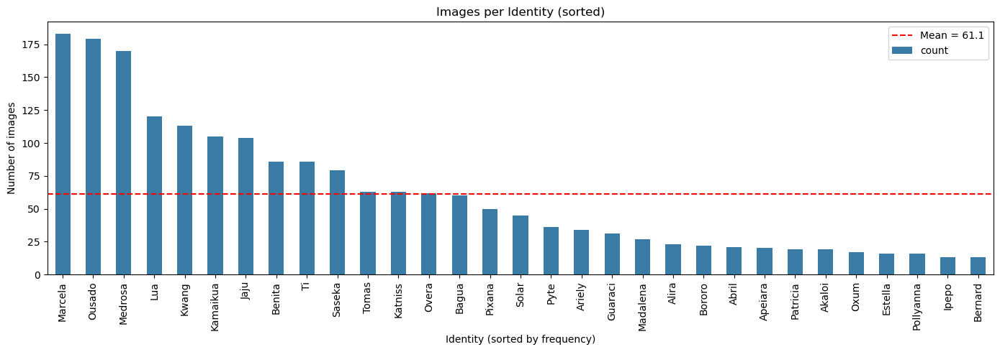
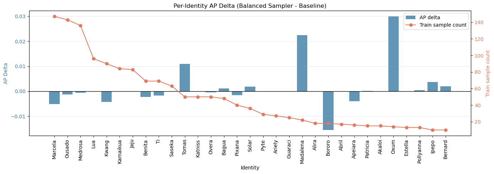
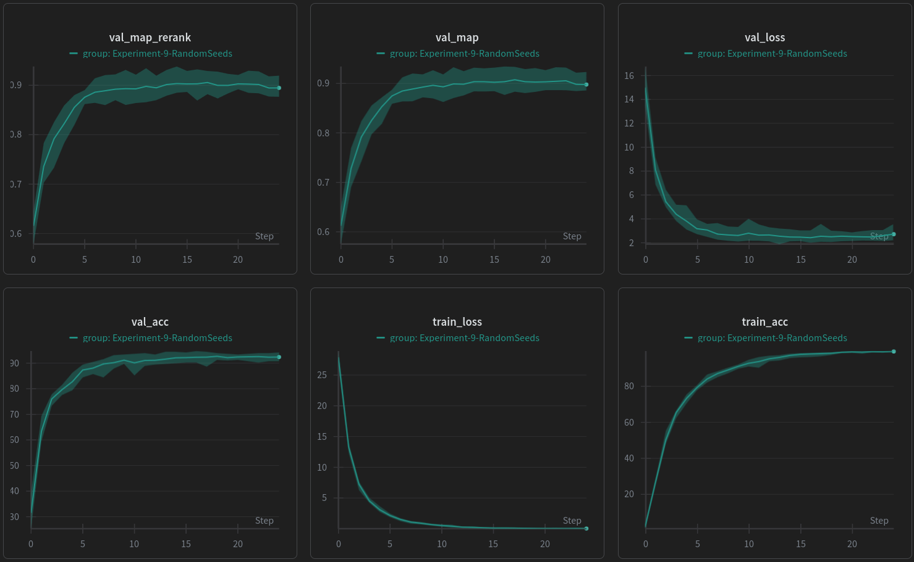
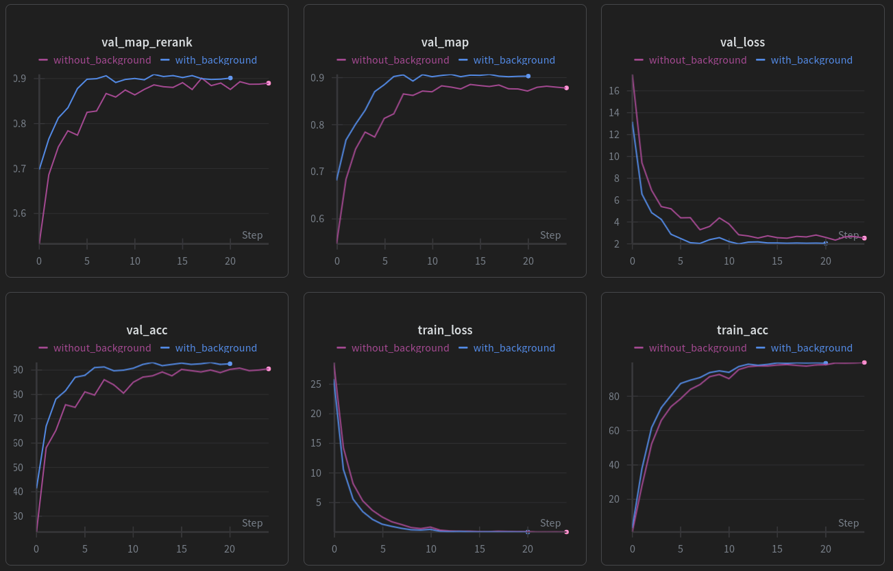
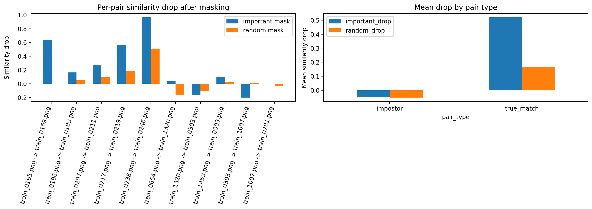

## Experiment 3 - Weighted Sampling

| [Notebook](notebooks/03_weighted_sampling.ipynb) | 
[W&B Run Group](https://wandb.ai/juggling-jaguars/jaguar-reid-jugglingjaguars/groups/Experiment-3-WeightedSampling) |

In the first two experiments we compared model backbones and loss functions evaluating what achieves the highest identity balanced mAP. In this experiment we want to not only look at the final identity balanced mAP but also on the performance of the different identities individually. The dataset is very imbalanced: Some of the 31 identities have very many images while others have only a few. Marcela has with 183 the highest number of images while Bernard has with only 13 images the fewest.

The goal of this experiment is to test whether the class imbalance is a bottleneck for retrieval quality.  Our metric (identity-balanced mAP) gives each identity equal importance, but the training distribution does not: frequent identities contribute many more updates than rare identities. Using weighted sampling shows rare identites more often which could increase their individual average precision (AP) and also the overall identity-balanced mAP.

**Research Question:** Does using weighted sampling improve average precision for low frequency identites and does it improve overall identity-balanced mAP?

### Setup

**Baseline:** standard shuffled sampling (`DataLoader(..., shuffle=True)`) on the embedding dataset. In this baseline, each training image appears exactly once per epoch, but in a random order that changes each epoch.

**Intervention:** weighted sampling with replacement (`WeightedRandomSampler`).
This means an epoch still has the same number of samples, but now samples are drawn probabilistically: some images can appear multiple times and some may not appear in a given epoch. As weights we use the inverse of the square root of the class frequencies ($w_c = 1/\sqrt{n_c}$). This means sampling will not be exactly balanced as it would be when using the full inverse frequency ($1 / n_c$), but it still increases exposure for rare identites. Using the full inverse frequency often over-corrects in small datasets so using the square root is a tempered alternative which tends to be more stable and less destructive for higher frequency identities.

The backbone (EVA-02) and loss function (ArcFace) as well the data split (train/val) and all other settings and hyperparameter will be fixed. We run each alternative **five times** using a different random seed each time (10, 38, 56, 102, 2024) and compute averages and standard deviations for all metrics. This way we strengthen the evidence even if the variation is high.

### Results

If we look at the overall identity-balanced mAP for the validation data we only see a **very small average improvement of 0.001** when using a weighted sampler, as shown in the following table:

|variant|num runs|val mAP mean|val mAP std|
|--|--|--:|--:|
|weighted sampler|5|0.8611|0.0076|
|random sampler|5|0.8599|0.0071|

Now we look at the individual identities. The following table shows the top movers: Three identites which AP increased the most and the three identities where it decreased the most. All shown APs are averages of the results across the five random seeds.

|identity|train samples|AP baseline|AP weighted sampler|difference|
|--|--|--|--|--|
|Oxum|14|0.820|0.850|+ 0.030|
|Madalena|22|0.976|0.998|+ 0.0224|
|Tomas|50|0.910|0.921|+ 0.011|
||
|Bororo|18|0.522|0.507|- 0.015|
|Marcela|147|0.897|0.892|- 0.005|
|Kwang|90|0.997|0.992|- 0.005|

In the following figure we visualize the AP differences per identity sorted by class frequency. We can see that there are only a few identites with a substantial AP delta. The greatest changes, positive and negative, happend for lower frequency identites, which is expected. The highest frequency identites tend to slightly decrease in AP which is also expected as they were given less importance to than in the baseline. 

Especially Oxum and Madalena benefit from the weighted sampling while Bororo decreases the most. We have inspected the images of Oxum and Bororo: Both have only little data but Oxum's images are almost all of very high quality. Bororo on the other hand, while also having *some* high quality images, is more noisy: In many images the Jaguar is mostly covered by vegetation and is hardly visible. We therefore conclude that the benefit of weighted sampling depends on the quality of the data. If many samples are of low quality, oversampling them can also worsen performance. 

### Conclusion

Weighted sampling does improve average precision for some identites, but can have the opposite effect if the data is low quality. This makes the overall mAP improvement in our dataset extremely small (+ 0.001). For better results it would be important to focus on data quality.

## Experiment 9 - Random Seed Comparison

| [Notebook](notebooks/09_seed_comparison.ipynb) |
[W&B Run Group](https://wandb.ai/juggling-jaguars/jaguar-reid-jugglingjaguars/groups/Experiment-9-RandomSeeds) |

After fixing the training parameters, we wanted to measure how much variance remains purely from the random seed. This is important because if seed-to-seed variance is large, then small differences between experimental tweaks can be misleading unless runs are repeated. In our setup the seed affects several parts of the pipeline, especially weight initialization in the ArcFace head and projection layers, and the order of batches during training.

**Research Question:** How large is the performance variation caused purely by the random seed, and are single-run improvements large enough to be trusted without repetition?

### Setup

We keep the full training configuration fixed and only vary the random seed. The compared model is the EVA unfrozen ArcFace setup with the following fixed hyperparameters:

- head learning rate `1e-4`
- backbone learning rate `1e-5`
- weight decay `1e-5`
- dropout `0.2`
- training augmentation enabled
- batch size `16`
- reranking enabled with `k1=20`, `k2=6`, `lambda=0.3`

We run the same experiment for **10 seeds** (`42` to `51`) and compare the best validation metrics of each run.

### Results

|seed|best val mAP|best val mAP rerank|best val loss|best epoch|epochs trained|
|--:|--:|--:|--:|--:|--:|
|43|0.9308|0.9381|2.1995|15|23|
|48|0.9246|0.9313|2.2370|10|18|
|46|0.9249|0.9228|2.0425|17|25|
|51|0.9176|0.9213|2.5083|10|18|
|49|0.9116|0.9112|2.6716|22|25|
|50|0.8978|0.9036|2.8094|17|25|
|42|0.8989|0.8997|2.3413|18|25|
|45|0.8985|0.8960|2.2614|18|25|
|47|0.8880|0.8929|2.4787|9|17|
|44|0.8866|0.8920|2.8812|21|25|

Across the 10 seeds, the mean reranked validation mAP is **0.9109 +- 0.0166**. The best run reaches **0.9381** (seed 43), while the weakest run reaches **0.8920** (seed 44). This spread is substantial and larger than many of the marginal effects observed in other experiments such as GeM pooling ([experiment 7](LEADERBOARD_EXPERIMENTS.md#experiment-7---gem-pooling)), or Test-Time Augmentation ([experiment 8](LEADERBOARD_EXPERIMENTS.md#experiment-8---test-time-augmentation)).

From the W&B curves we can also see that the spread in validation mAP is larger than the spread in validation loss or accuracy. This is plausible because mAP is a ranking-based retrieval metric and is therefore much more sensitive to relatively small shifts in the embedding space. Two runs can have similar classification metrics while still producing noticeably different neighbor rankings for individual identities, which then changes retrieval performance more strongly than it changes average loss or top-1 accuracy.

The conclusion is that training seed has a meaningful impact on final retrieval performance in this setup. Therefore, single-run comparisons should be interpreted carefully, and strong results should ideally be confirmed across multiple seeds.

## Experiment 10 - Background vs. no Background

| [Notebook](notebooks/10_background.ipynb) | 
[W&B Run Group](https://wandb.ai/juggling-jaguars/jaguar-reid-jugglingjaguars/groups/Experiment-10-Background/) | Round 1 public score: 0.912 | Round 2 public score: 0.899 |

In all previous experiments we always used the complete images with background information and just ignored the alpha mask. In this experiment we use the dataset of the **Kaggle competition round 2** which does not include background information at all. We train our best model on both datasets and compare its performance.

**Research question:** How does our currently best model configuration perform (mAP) when it is trained and evaluated on data without background? How does a model trained on data with background perform when applied on data without background and otherwise?

### Setup

We keep the model configuration fixed (EVA-02, ArcFace, Reranking, all training hyperparameters) and compare two data sources:

- **data_with_background**: images of Kaggle competition round 1, including RGB background
- **data_without_background**: images of Kaggle competition round 2, with background completely removed

To make the comparison fair we enforce a **shared validation split** across both datasets, so the train and val partitions of both datasets include the same images (only with or without background). We train a fresh model on each dataset and run a **2x2 cross-evaluation**:
  - train on `data_with_background`, evaluate on `data_with_background`
  - train on `data_with_background`, evaluate on `data_without_background`
  - train on `data_without_background`, evaluate on `data_with_background`
  - train on `data_without_background`, evaluate on `data_without_background`

### Results

The results of the two runs are in the following table. We used both models to create a submission for their respective Kaggle competition. We report the resulting public scores in the following table too:

|train data|eval data|val mAP|val mAP rerank|kaggle public score|
|--|--|--:|--:|--:|
|with background|with background|**0.9070**|**0.9095**|0.912 (round 1)|
|without background|without background|0.8845|0.9010|0.899 (round 2)|

The model trained and evaluated on data with background achieves a better result than the model that is trained and evaluated on the data without background. However, when using k-reciprocal re-ranking, the difference in validation mAP becomes small (+0.008 when using data with background). This shows that our model and hyperparameter configuration is generally suitable for both versions of the data.

Cross-evaluation shows a stronger effect:

|train data|eval data|val mAP|val mAP rerank|
|--|--|--:|--:|
|with background|without background|0.6314|0.6486|
|without background|with background|0.8311|0.8470|

When evaluated on the opposite dataset, both models degrade significantly, especially the model trained on data **with** background and evaluated on the data **without** background. This suggests that the background RGB values are not just harmless noise. They appear to create a real domain shift that the model learns to rely on, so moving from data with background to data without background changes the image distribution enough that embeddings no longer transfer cleanly between the two datasets.

## Experiment 11 - Interpretability with Integrated Gradients

| [Notebook](notebooks/11_interpretability.ipynb) |
[W&B Run Group](https://wandb.ai/juggling-jaguars/jaguar-reid-jugglingjaguars/groups/Experiment-11-Interpretability) |
[Results Directory](interpretability_results/) |

This experiment focuses on understanding which image regions drive the model's identity predictions. Instead of treating the model as a black box and only comparing final mAP values, we want to inspect whether identity decisions are actually based on jaguar-specific fur patterns and body regions, or whether irrelevant context such as vegetation and background contributes strongly. We want to conduct this interpretability analysis using Integrated Gradients.

**Research Question:** Which image regions contribute most to the model's identity prediction, and are these attribution maps meaningful under sanity and faithfulness checks?

### Setup

For the final version of this experiment we use an end-to-end **EfficientNetB3** ArcFace model. 

The original idea was to conduct this interpretability analysis on our strongest leaderboard model which uses EVA-02 as backbone. However running Integrated Gradients on the full EVA-02 backbone exceeded the GPU memory of our available hardware (A100 80GB on the HPI sci cluster). We decided to do the interpretability experiment with an **EfficientNet3** backbone model instead. This is still meaningful: although EfficientNet performs clearly worse than the best EVA-02 model (best valdiation mAP of `~0.80` vs. `~0.91`), it is still a fully trained jaguar re-identification model and therefore allows us to study whether the learned decision process focuses on plausible jaguar identity cues at all.

The interpretability analysis is performed on a fully fine-tuned, end-to-end EfficientNet-ArcFace model, not on cached embeddings. This is important because the attribution method must be able to propagate relevance from the final class score all the way back to the input pixels. We therefore train a complete model and wrap it as a cosine-score classifier for attribution.

We use **Integrated Gradients** from Captum. The attribution target is the cosine class score induced by the trained ArcFace weights, not the margin-modified training logit.

We also conduct two additional sanity checks:

- **Randomization sanity check**  to verify that the attribution maps lose structure when the trained weights are destroyed
- **Masking faithfulness test** that measures how much embedding similarity drops when the most relevant pixels are removed

### Results

We started by training the EfficientNetB3-Arcface model. The run is logged to W&B under the run ID [udul9c1d](https://wandb.ai/juggling-jaguars/jaguar-reid-jugglingjaguars/runs/udul9c1d).

We score all validation images with the model's predicted cosine class score and inspect a small set of high-confidence correct predictions. We visualize the heatmaps below. The heatmaps are not extremely sharp, but they are also not uniformly spread across the whole image. In many cases, especially for the images of Bagua and Ousado, the strongest activations lie on contiguous parts of the jaguar body, such as the eyes, nose, mouth and also on the rosette pattern on the fur, rather than on the entire frame, which suggests that the model is using localized visual identity cues instead of responding completely arbitrarily. However Kamaikua's image is also an example where the attributions in the heatmaps are also largly scattered on the background. 

We do the same with some misclassified images, viszalized below. These maps are generally slighlty harder to interpret and look less coherent than for the correct predictions.

#### Randomization Sanity Check

For this sanity check we randomized the weights our model and did the attribution process again for the best scoring images. We can see that the heatmaps now are essentially black, which signifies that the structured attribution signal disappears once the learned weights are destroyed. This is what we would expect from a meaningful attribution method and therefore counts as a positive sanity-check result.

#### Masking Faithfulness Test

For this test we choose 10 pairs of images: five true matches (images show the same jaguar) and 5 imposters (images show different jaguars). For each pair we calculate the embedding cosine similarity. Then we **mask out the top 10% most important pixels** according to the attribution maps and measure the similarity again. We do the same with a random mask of the **same number of pixels**. The results are visualized in the figure below. In the left plot are the drops in similarity per image pair: the first 5 pairs are true matches and the last 5 are imposters. We can see that for true matches the similarity drops when using the important-pixel mask are quite different but generally high, ranging from `0.16` to `0.96` with a mean drop of `0.52` (visualized in the right figure). The drops when using a random mask of the same size are much smaller. 

For the imposters all drops are significantly smaller and on average even slightly negative (`0.049` for the important mask and `0.052` for the random mask). That means the prediction score even got slightly better after the masking.

This is a meaningful faithfulness result for the true matches: masking pixels that Integrated Gradients marks as important damages the similarity much more strongly than masking a random region of equal size. For imposters the effect is weaker and less consistent, which is also plausible because there is no strong positive match signal that must be destroyed.

