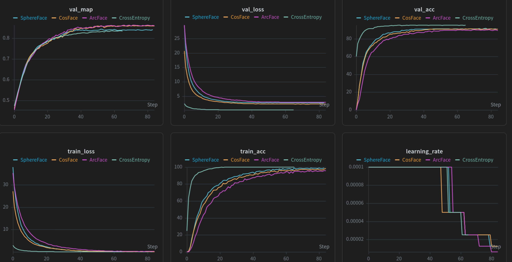
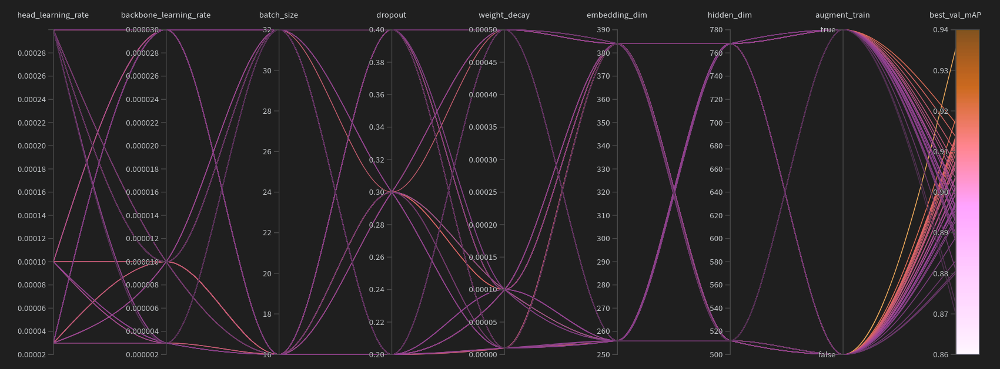
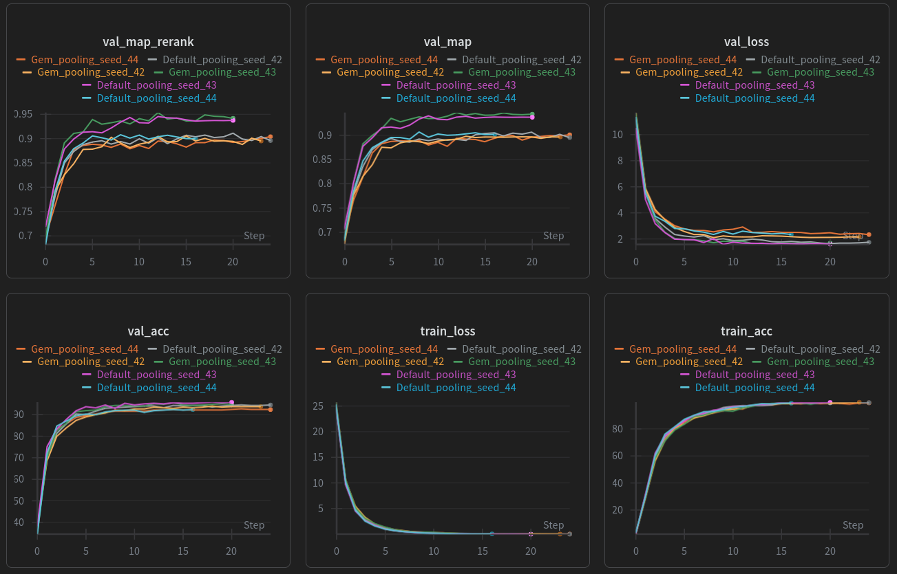

## Experiment 1 - Backbone Comparison

| [Notebook](notebooks/01_backbones.ipynb) | 
[W&B Run Group](https://wandb.ai/juggling-jaguars/jaguar-reid-jugglingjaguars/groups/Experiment-1-Backbones) | 
Kaggle Submission Score: 0.871 (EVA-02)| 

The backbone creates the base embeddings and is therefore one of the most important parts of the model. Different backbones can have different architectures, different input and output sizes, and different number of parameters, so the decision can have important implications on performance but also on efficiency. In this experiment we want to compare 5 different backbones to see which one results the best mAP. 

### Setup

We will compare 5 backbone models, among them traditional and modern CNNs, medium and large sized ViTs, and supervised and self-supervised pretrained models:

- **MegaDescriptor-L-384** - This is the competitions baseline
- **ResNet50** - A traditional CNN and often a reference model in literature
- **EfficientNetB3** - A more modern, very parameter-efficient CNN
- **DINOv3 ViT-Base** - Large, self-supervised ViT
- **EVA-02 Large** - Large, pretrained ViT foundation model

**Research Questions:**
Which architecture returns the best mAP? How do parameter-efficient CNNs perform in comparison to large vision transfomers?

The initial embeddings created by the backbones will get projected to 256 dimensional embeddings using two linear layers, followed by an ArcFace Loss layer. The backbone itself will not be trained in this experiment. For the image preprocessing transformations, we resize the images to whichever input size the backbone requires. After that we apply a normalization transform using the mean and std that is provided by the backbone. We do not use any random augmentations.

All other hyperparameters and the training procedure are identical for all runs. We use a batch size of 32, dropout of 0.3, AdamW as optimizer, and ReduceLROnPlateau as scheduler. We train 100 epochs with a patience of 10 epochs, that means if for 10 consecutive epochs we can not beat the currently best validation loss we stop training early. In the result table below we report how many epochs each model trained. After training we always restore the best checkpoint (by validation loss) to compute metrics and create the kaggle submission.

### Results

In the table below we report some essential metrics of the runs. More metrics such as losses, learning rates, etc are logged in W&B.

|backbone|architecture|parameter|input size|epochs (best) |best val mAP|kaggle public score|
|--|--|--:|--|--|--|--|
|MegaDescriptor|Swin Transformer|195,198,516|384|84 (74)|0.784|0.754|
|ResNet50|CNN|23,508,032|288|91 (81)|0.817|0.728|
|EfficientNetB3|CNN|10,696,232|300|100 (90)|0.841|0.759|
|DINOv3|ViT|303,079,424|256|99 (89)|0.867|0.841|
|EVA-02|ViT|304,055,232|448|84 (74)|0.862|0.871|

DINOv3 gives the strongest validation mAP in this setup, with EVA-02 close behind. On the test set in Kaggle, EVA-02 scored an even better public score of 0.871, while DINOv3 got only 0.841. We conclude that large ViT backbones are currently the best choice for this task. 
EfficientNetB3 also performs surprisingly well for its tiny size in comparison and even outperforms ResNet50 and the much larger MegaDescriptor. That makes EfficientNetB3 a very space and compute efficient option. However, we only focus on achieving the best performance, so for leaderboard submissions we will prioritize EVA-02.

## Experiment 2 - Loss Function Comparison

| [Notebook](notebooks/02_loss_functions.ipynb) | 
[W&B Run Group](https://wandb.ai/juggling-jaguars/jaguar-reid-jugglingjaguars/groups/Experiment-2-LossFunctions) | 
no improvement over experiment 1: 0.871 (ArcFace) | 

In Experiment 1 we fixed the loss to the metric learning loss ArcFace. Here we want to understand ArcFace and metric learning in general better by comparing it to plain CrossEntropy and the very similar alternatives SphereFace and CosFace. Compared to plain classification which only optimizes correct class assignment, metric learning explicitly shapes the embedding space by pulling samples of the same identity closer and pushing different identities farther apart. The goal of this experiment is to answer whether margin-based metric learning improves mAP performance and which margin variant works best in our setup.

### Setup

We use the best performing backbone from experiment 1, which is EVA-02. All other settings are fixed and identical to experiment 1 (same split, same optimizer/scheduler, same training budget and patience). We only change the loss/head formulation.

The compared losses are:
- **CrossEntropy** - standard for classification tasks and therefore an important baseline. Useful to quantify how much margin-based metric learning really helps
- **SphereFace** - first major angular-margin softmax formulation (2017)
- **CosFace** - additive cosine margin
- **ArcFace** - additive angular margin and common modern default for re-id tasks.

Because each method applies margin in a different way (additive angular, additive cosine, multiplicative angular) the margin values are not comparable (i.e. we can not use the same margin m for each loss). Therefore we use estalished defaults for each method for a fair comparison:  **ArcFace m=0.5**, **CosFace m=0.35**, and **SphereFace m=1.35**.

**Research questions:** Do margin-based metric learning losses improve mAP over plain CrossEntropy? Which method performs best for this dataset?

### Results

|loss |margin type|margin|epochs (best) |best val acc|best val mAP|
|--|--|--|--|--|--|
|CrossEntropy|-|-|66 (56)|0.955|0.835|
|SphereFace|multiplicative angular|1.35|84 (74)|0.918|0.841|
|CosFace|additive cosine|0.35|85 (75)|0.913|0.858|
|ArcFace|additive angular|0.5|85 (75)|0.902|0.860|

CrossEntropy achives the highest validation accuracy but clearly underperforms on mAP. This is expected because CE optimizes class prediction rather than embedding alignment which is needed for good similarities. The strong class imbalance likely amplifies this effect: accuracy and CE are dominated by frequent identities, while our mAP is identity-balanced and gives equal importance to rare identities. 

From the learning curves we can also observe that CE shows much steeper early loss and accuracy improvements and converges earlier than the other losses. This is consistent with CE being an easier optimization objective, while ArcFace/CosFace spend more time on enforcing stricter embedding clustering/separation.

ArcFace and CosFace perform very similarly and both achieve substantially better mAP than CrossEntropy. This shows that explicit margin constraints improve embedding separability for retrieval. SphereFace also improves over CrossEntropy but remains below ArcFace/CosFace. For the next experiments we will therefore continue with ArcFace.

## Experiment 4 - Backbone Fine-Tuning

| [Notebook](notebooks/04_backbone_finetuning.ipynb) | 
[W&B Run Group](https://wandb.ai/juggling-jaguars/jaguar-reid-jugglingjaguars/groups/Experiment-4-BackboneFinetuning/) | 
Kaggle Submission Score: 0.907 (fine-tune all) | 

In the last experiments we always froze the backbone and just trained a few linear layers as embedding projection and the ArcFace head model. However, the backbone is pretrained on huge amounts of general image data with the training goal of general image classification. The backbone is therefore not specialized on our specific task of jaguar re-identification. Fine-tuning the last few layers or even the entire backbone can often help the model adapt to a specific task and dataset. 

**Research question:** Does fine-tuning the backbone during training can achieve a higher identity balanced mAP?

### Setup

We use the previously best performing backbone which is EVA-02 Large. This model is a vision transformer and consists of **24 identical transfomer-encoder blocks** (self-attention, SwiGlu, RoPE, MLP). Each of these blocks have around 12.6 million parameters which sums up to around 304 million parameters in total. 
We evaluate different levels of backbone fine-tuning/freezing:

- **Backbone completely frozen** - the backbone is not retrained at all. This is the baseline.
- **Fine-Tune last 2 Blocks** - only last 2 transformer-encoder blocks are trainable
- **Fine-Tune last 4 Blocks**
- **Fine-Tune last 8 Blocks**
- **Fine-Tune the entire backbone** - this makes all backbone parameters trainable

Since the EVA-02 model is large and our data is relativly small, backpropagation and weight updates on the backbone comes with risks of changing the backbone to much and thus "destroying" the pretrained weights. Therefore we will use a smaller learning rate for the backbone parameters: The backbone learning rate will be `1e-5` which is ten times smaller than the learning rate for the ArcFace head (`1e-4`).

For the run with the fully frozen backbone we precompute the backbone embeddings for all training and validation data once and cache them to speed up training (same how we did it in the first three experiments). The other runs are trained end-to-end, so all images are processed through the backbone again in every forward pass, which leads to much longe training times. All other hyperparameters will be fixed for each run. All runs get a budget of 100 epochs with a patience of 8 for early stopping. The learning rate for both head and backbone is scheduled using `ReduceLROnPlateau` with a patience of 2.

Next to the identity-balanced mAP on the validation data we also compute the mAP after applying k-reciprocal rerank (k1=20, k2=6, lambda=0.3) as evaluation metric. However, the effect of this reranking itself is not the main research goal of this experiment, in [experiment 6](#experiment-6---k-reciprocal-re-ranking) we will evaluate this further.

### Results

|run|backbone trainable params|epochs trained|time per epoch|best val mAP|best val mAP rerank|kaggle public score|
|--|--:|--:|--:|--:|--:|--:|
|freeze all|0|60| 2.9 s|0.854|0.860|-|
|train last 2|25,202,000|39|6.00 min|0.874|0.877|-|
|train last 4|50,401,952|28|6.14 min|0.881|0.888|-|
|train last 8|101,467,456|19|5.51 min|0.886|0.887|-|
|train all|304,055,232|16|5.71 min|0.902|0.901|0.907|

The results show a clear monotonic trend: unfreezing more of the EVA-02 backbone consistently improves validation mAP, and full end-to-end fine-tuning performs best by a noticeable margin over the frozen baseline. This suggests that the pretrained features still benefit substantially from task-specific adaptation to jaguar re-identification. At the same time, the compute cost increases dramatically once the backbone is no longer cached, so the gain comes with a significant training-time tradeoff. 

From the graphs we can also see that models with more trainable parameters have a steeper learning curve and converged earlier. This indicates that the additional trainable backbone capacity allows the model to adapt to the jaguar-specific identity cues much faster.

## Experiment 5 - Hyperparameter Search

| [Notebook](notebooks/05_hyperparamter_search.ipynb) | 
[W&B Run Group](https://wandb.ai/juggling-jaguars/jaguar-reid-jugglingjaguars/groups/Experiment-5-HyperparameterSearch) | [W&B Sweep](https://wandb.ai/juggling-jaguars/jaguar-reid-jugglingjaguars/sweeps/df5f8s4d) |
Kaggle Submission Score: 0.912 | 

In the previous experiments we fixed the general training hyperparameters such as learning rate, dropout, weight decay, batch size as well as architecture decisions such as the embedding dimension. This already achieved a strong Kaggle score of `0.907`, but these hyperparameters were still chosen manually. The goal of this experiment is therefore to identify a better combination of learning rates, regularization and head width. Also part of this experiment is to test if training augmentation can help improving mAP, so we include training augmentation (yes/no) in the search space.

**Research question:** Which hyperparameter configuration achieves the best identity-balanced mAP?

### Setup

We keep the overall model architecture fixed:

- **Backbone:** EVA-02 Large (input size: 448)
- **Training mode:** full backbone fine-tuning
- **Loss/head:** ArcFace with `margin=0.5`, `scale=64`
- **Optimizer:** AdamW
- **Scheduler:** ReduceLROnPlateau with patience `2`
- **Validation split:** `0.2`
- **Seed:** `42`
- **Reranking during validation:** enabled with `k1=20`, `k2=6`, `lambda=0.3`

Similar to experiment 4, we not only calculate the identity-balanced mAP on the validation data, but also compute it again with k-reciprocal reranking applied. We use both metrics for the experiment evaluation. Deeper investigations about k-reciprocal reranking can be found in [experiment 6](#experiment-6---k-reciprocal-re-ranking).

### Search Space

We perform a **random search** over the following parameters:

|parameter|possible values|
|--|--|
|head learning rate|`3e-5`, `1e-4`, `3e-4`|
|backbone learning rate|`3e-6`, `1e-5`, `3e-5`|
|weight decay|`1e-5`, `1e-4`, `5e-4`|
|dropout|`0.2`, `0.3`, `0.4`|
|train augmentation|`True`, `False`|
|batch size|`16`, `32`|
|embedding dimension|`256`, `384`|
|hidden dimension|`512`, `768`|

This search space leads to **1296 possible combinations**. We randomly sample **48 configurations** and train a fresh model each time. With 48 random samples, the probability of evaluating at least one configuration from the top 5% of the search space is about 91%, and over 99% for the top 10%. Since each run takes about 2-3 hours training time, this sample size is a reasonable compromise between computational cost and search space coverage.

For runs with training augmention we do the following random transforms:

- RandomResizedCrop: scale=(0.85, 1.0), ratio=(0.9, 1.1)
- RandomAffine: degrees=15, translate=0.1, scale=(0.9, 1.1)
- ColorJitter: brightness=0.2, contrast=0.2, saturation=0.15, hue=0.03
- RandomGaussianBlur: p=0.15, kernel=3 
- RandomAdjustSharpness: p=0.1, factor=1.5
- RandomErasing: p=0.25

### Results

In total we trained 48 configurations and logged them to W&B. We also added the runs to a [W&B Sweep](https://wandb.ai/juggling-jaguars/jaguar-reid-jugglingjaguars/sweeps/df5f8s4d) for the parameter importance analysis, although we did not use W&B agents or other W&B sweep features.

In the table below we report the strongest configurations:

|W&B run id|head lr|back-bone lr|weight decay|drop-out|aug|batch|embed|hidden|best val mAP|best val mAP rerank|best val loss|best epoch|
|--|--:|--:|--:|--:|--|--:|--:|--:|--:|--:|--:|--:|
|[qriyulso](https://wandb.ai/juggling-jaguars/jaguar-reid-jugglingjaguars/groups/Experiment-5-HyperparameterSearch/runs/qriyulso)|1e-4|1e-5|1e-5|0.2|on|16|384|768|0.917|**0.937**|2.266|18|
|[qp8fg51n](https://wandb.ai/juggling-jaguars/jaguar-reid-jugglingjaguars/groups/Experiment-5-HyperparameterSearch/runs/qp8fg51n)|3e-4|3e-5|1e-4|0.3|off|16|256|512|**0.936**|0.934|2.494|10|
|[k2pi28gh](https://wandb.ai/juggling-jaguars/jaguar-reid-jugglingjaguars/groups/Experiment-5-HyperparameterSearch/runs/k2pi28gh)|3e-5|3e-5|1e-4|0.2|off|16|384|768|0.910|0.924|**1.893**|21|
|[v67i2spa](https://wandb.ai/juggling-jaguars/jaguar-reid-jugglingjaguars/groups/Experiment-5-HyperparameterSearch/runs/v67i2spa)|3e-4|1e-5|5e-4|0.2|on|32|384|768|0.899|0.923|2.157|8|
|[b40hr4rt](https://wandb.ai/juggling-jaguars/jaguar-reid-jugglingjaguars/groups/Experiment-5-HyperparameterSearch/runs/b40hr4rt)|3e-5|1e-5|5e-4|0.3|off|16|384|768|0.913|0.920|1.824|25|

In W&B we analyzed the parameter importance with respect to the best validation mAP:

|parameter|importance|correlation|
|--|--|--|
|head learning rate|0.261|-0.179|
|hidden dimension|0.143|0.155|
|weight decay|0.123|-0.233|
|train augmentation|0.125|-0.353|
|dropout|0.118|-0.016|
|backbone learning rate|0.090|0.143|
|embedding dimension|0.076|0.142|
|batch size|0.055|-0.328|

Several useful patterns emerge from the search:

- **Batch size 16** dominates the top runs. All five best runs use batch size `16`.
- **384 / 768** is a strong head size. Most top rerank results use `embedding_dim=384` and `hidden_dim=768`.
- **Low dropout helps.** The strongest runs use `0.2` or `0.3`. `0.4` appears less competitive.
- **Both augmentation settings can work.** The best run according to the reranked mAP uses augmentation, but several other top runs perform best without it.
- **Reranked ranking and plain mAP do not always choose the same winner.** One run achieves the best plain validation mAP (`0.936`) but is slightly behind the best reranked validation mAP (`0.937`).

The W&B parameter importance analysis broadly supports these observations: among the tested hyperparameters, the head learning rate had the strongest estimated influence on validation mAP, followed by the hidden dimension and weight decay. At the same time, the negative correlations for train augmentation and batch size suggest that, within this search space, smaller batches and disabling augmentation were slightly more favorable on average, even though individual top runs still exist with augmentation enabled.

The best run of the search is therefore [qriyulso](https://wandb.ai/juggling-jaguars/jaguar-reid-jugglingjaguars/groups/Experiment-5-HyperparameterSearch/runs/qriyulso) with a best validation mAP of **0.917** and a best reranked validation mAP of **0.937**. This run's configuration is different to the default configuration that we used in previous experiments (this one has a lower dropout, higher embedding and hidden dim and smaller batch size). This run therefore becomes the new default checkpoint for later experiments. We used it for a Kaggle submission (with reranking) which improved the Kaggle public score from `0.907` to `0.912`.

## Experiment 6a - K-Reciprocal Re-Ranking Parameter Sweep

| [Notebook](notebooks/06_k_reciprocal_re_ranking.ipynb) | 
[W&B Project](https://wandb.ai/juggling-jaguars/jaguar-reid-jugglingjaguars/groups/Experiment-6-KReciprocalReRanking) | 
No new Kaggle submission | 

We wanted to test whether the default k-reciprocal reranking parameters were already good enough for our current validation setup, or whether a small validation-only sweep over `k1` and `lambda_value` could still improve retrieval.

### Setup

We selected the best model from the hyperparameter search ([qriyulso](https://wandb.ai/juggling-jaguars/jaguar-reid-jugglingjaguars/groups/Experiment-5-HyperparameterSearch/runs/qriyulso)) and use it to compute the similarity matrix on the validation data once. Then we only tune the postprocessing on this matrix. The hyperparameters of the used model are:

- **Backbone:** EVA-02 Large (fine-tuned end-to-end)
- **Head learning rate:** `3e-5`
- **Backbone learning rate:** `3e-5`
- **Weight decay:** `1e-4`
- **Dropout:** `0.2`
- **Train augmentation:** off
- **Batch size:** `16`
- **Embedding / hidden dim:** `384 / 768`
- **Best checkpoint epoch:** `21`

We run a small grid search over the k-reciprocal re-ranking parameters:

- **`k1`** in `{10, 15, 20, 25, 30, 35, 40}`
- **`lambda_value`** in `{0.05, 0.1, 0.2, 0.3, 0.4, 0.5, 0.6}`
- **`k2`** fixed at `6`

This leads to 49 runs in total. For each configuration we rerank the similarity matrix, compute the new validation mAP and compare it against both the no-rerank baseline and to the default rerank setting.

### Results

|setting|val mAP rerank|
|--|--:|
|no reranking|0.910|
|default rerank (`k1=20`, `k2=6`, `lambda=0.3`)|**0.924**|
|best grid-search result|**0.924**|

The validation sweep did **not** improve on the default reranking setup. The best searched configuration was again:

- **`k1=20`**
- **`k2=6`**
- **`lambda_value=0.3`**

This means the tuned search gained:

- **`+0.014`** over no reranking
- **`+0.000`** over the default reranking parameters

So the practical conclusion is modest but useful: **for this checkpoint and this validation split, the existing rerank defaults were already as good as the tested alternatives**.

### Limitations

This result is based on **one specific checkpoint** and **one validation split**, so it should be interpreted as a targeted sanity check rather than a universal statement about reranking. In addition, the evaluated checkpoint was already selected with the same default reranking parameters (`k1=20`, `k2=6`, `lambda=0.3`), which biases the sweep toward rediscovering those defaults.

We therefore treat this experiment mainly as a **sanity check**: it supports keeping the standard rerank parameters for later experiments, but it does **not** prove that reranking can no longer be improved in general.

## Experiment 6b - Reranking Effects During Hyperparameter Search

During each hyperparameter search run we logged both plain validation mAP and reranked validation mAP in W&B. We use these results here only to understand whether reranking can change model ranking across runs; this is a different question from the main Experiment 6 sweep, which asks whether the default reranking parameters can be improved for one fixed checkpoint.

If we compare each run only at its **best saved checkpoint**, `best_val_mAP_rerank - best_val_mAP` is on average **`+0.003`**, and **30 of 48 runs** improve under reranking. Since these are best-checkpoint summaries from a search where reranking was already part of validation, they are informative about ranking shifts, but they should not be interpreted as a fully unbiased estimate of reranking gain.

The most important effect is the change in **model ranking**:

- The best run by plain validation mAP is [qp8fg51n](https://wandb.ai/juggling-jaguars/jaguar-reid-jugglingjaguars/groups/Experiment-5-HyperparameterSearch/runs/qp8fg51n) with **`best_val_mAP = 0.936`**, but its reranked score is slightly lower at **`0.934`**.
- The best run by reranked validation mAP is [qriyulso](https://wandb.ai/juggling-jaguars/jaguar-reid-jugglingjaguars/groups/Experiment-5-HyperparameterSearch/runs/qriyulso) with **`best_val_mAP_rerank = 0.937`**, even though its plain best mAP is only **`0.917`**.
- The checkpoint used in the Experiment 6 sanity check is [k2pi28gh](https://wandb.ai/juggling-jaguars/jaguar-reid-jugglingjaguars/groups/Experiment-5-HyperparameterSearch/runs/k2pi28gh), a good example of a run that benefits meaningfully from reranking: **`0.910 -> 0.924`** at the best checkpoint.

So the comparison in **W&B** supports two conclusions at once: first, reranking can matter enough to change which hyperparameter setting looks best; second, that does **not** contradict the main Experiment 6 result, because the sweep there only shows that for one rerank-friendly checkpoint the standard parameter choice (`k1=20`, `k2=6`, `lambda=0.3`) was already very hard to beat.

## Experiment 7 - GeM Pooling

| [Notebook](notebooks/07_gem_pooling.ipynb) | 
[W&B Run Group](https://wandb.ai/juggling-jaguars/jaguar-reid-jugglingjaguars/groups/Experiment-7-GeMPooling) | 
Kaggle Submission Score: 0.903 | 

In this experiment we test whether replacing the backbone's default global pooling (mean pooling) with **generalizd mean pooling (GeM)** can improve jaguar re-identification. The motivation is that re-ID often depends on a few highly discriminative local fur patterns. GeM is more selective than plain mean pooling and can emphasize strong local activations instead of smoothing them away too aggressively.

**Research question:** Does GeM pooling improve retrieval quality over the default pooling for this EVA-based re-ID model?

### Setup

We keep the full training recipe fixed and change only the pooling layer inside the backbone:

- **Backbone:** EVA-02 Large (full backbone fine-tuning)
- **Head:** ArcFace with `margin=0.5`, `scale=64`
- **Embedding / hidden dim:** `256 / 512`
- **Dropout:** `0.3`
- **Batch size:** `32`
- **Head learning rate:** `1e-4`
- **Backbone learning rate:** `1e-5`
- **Weight decay:** `1e-4`
- **Train augmentation:** off
- **Validation split:** `0.2`
- **Reranking during validation:** `k1=20`, `k2=6`, `lambda=0.3`

The two compared runs are:

- **Default pooling**: standard backbone pooling as provided by the EVA model
- **GeM pooling**: replace the default pooling with GeM using `p=3.0` and `eps=1e-6`

This is a very targeted architectural test: if GeM helps here, the gain should come from better spatial aggregation rather than from a different optimizer, schedule, augmentation policy, or backbone. We train each version with three different training seeds (`42`, `43`, `44`) to avoid over-interpreting a single lucky run. Similar to the previous experiments we compute and report the validation mAP with and without reranking.

### Results

|variant|seeds|val mAP mean (std)|val mAP rerank mean (std) |
|--|--:|--:|--:|
|Default pooling|3|0.917 (0.018)|**0.922** (0.021) 
|GeM pooling|3|0.915 (0.028)|0.921 (0.0289)|

Seed-wise results:

|seed|default val mAP|GeM val mAP|delta GeM-default|default val mAP rerank|GeM val mAP rerank|delta GeM-default rerank|
|--:|--:|--:|--:|--:|--:|--:|
|42|0.9063|0.8964|-0.0099|0.9110|0.9055|-0.0055|
|43|0.9372|0.9468|+0.0096|0.9454|0.9537|+0.0083|
|44|0.9068|0.9008|-0.0060|0.9079|0.9039|-0.0040|

Across the paired seeds, the mean GeM-minus-default difference is:

- **`-0.0021`** in plain validation mAP
- **`-0.0004`** in reranked validation mAP

So GeM does not show a consistent improvement in this experiment. It helps on seed `43`, but loses on seeds `42` and `44`, and the average reranked result is almost unchanged.

With the current seed sweep, the answer to the research question is: GeM pooling does **not convincingly** improve retrieval quality. The GeM variant is competitive, but there is no reliable mean improvement over default pooling, so we do not treat GeM as a clearly better replacement in this setup.

## Experiment 8 - Test-Time Augmentation

| [Notebook](notebooks/08_test_time_augmentation.ipynb) | 
[W&B Run Group](https://wandb.ai/juggling-jaguars/jaguar-reid-jugglingjaguars/groups/Experiment-8-TestTimeAugmentation) | 
No new Kaggle submission (no validation improvement) | 

After establishing a strong EVA-02 fine-tuned baseline, we tested whether deterministic test-time augmentation can improve retrieval performance at inference time. The central question was simple: does TTA help our current model enough to justify the additional inference cost?

### Setup

We keep the model fixed and only change inference-time augmentation. We do not train a new model but load a checkpoint from a run from [experiment 9](EDA_EXPERIMENTS.md#experiment-9---random-seed-comparison) (run ID: [ej9qc2v3](https://wandb.ai/juggling-jaguars/jaguar-reid-jugglingjaguars/runs/ej9qc2v3)). We compare four deterministic TTA presets:

- **none** - only the default resized image
- **light** - base view plus a centered 95% crop
- **medium** - base view plus centered 95% and 90% crops
- **heavy** - medium plus off-center 90% crops (`top_left`, `bottom_right`)

For each TTA preset we extract embeddings for all views, average the embeddings, normalize them again, and compute both plain validation mAP and reranked validation mAP.

### Results

|TTA mode|views|val mAP|val mAP rerank|
|--|--:|--:|--:|
|none|1|0.8903|0.8930|
|light|2|0.8919|0.8920|
|medium|3|0.8922|0.8923|
|heavy|5|0.8915|0.8910|

The differences are marginal. While `light` and `medium` slightly improve the plain validation mAP, none of the deterministic TTA presets improves the reranked validation mAP over the no-TTA baseline. In fact, the best reranked score is obtained with **no TTA at all** (`0.8930`), while the larger TTA presets are slightly worse.

We therefore conclude that **deterministic crop-based TTA does not provide a meaningful benefit for this model in our setup**. Given the extra inference cost, we do not continue with TTA for leaderboard submissions.

## Experiment 10 - Background vs. no Background

| [Notebook](notebooks/10_background.ipynb) | 
[W&B Run Group](https://wandb.ai/juggling-jaguars/jaguar-reid-jugglingjaguars/groups/Experiment-10-Background/) | Round 1 public score: 0.912 | Round 2 public score: 0.899 |

In all previous experiments we always used the full images with background information and just ignored the alpha mask. In this experiment we use the dataset of the **Kaggle competition round 2** which does not include background information at all. We train our best model on both datasets and compare its performance.

**Research question:** Does our currently best model's performance (mAP) change when it is trained and evaluated on data without background? How does a model trained on data with background performs when applied on data without background and otherwise?

### Setup

We keep the model configuration fixed (EVA-02, ArcFace, Reranking, all training hyperparameters) and compare two data sources:

- **data_with_background**: images of Kaggle competition round 1, including RGB background
- **data_without_background**: images of Kaggle competition round 2, with background completely removed

To make the comparison fair both runs:

- use the same model and training hyperparameters
- enforces a shared validation split across both datasets (so the same images appear in train/val  respecively)
- trains a fresh model on each dataset
- runs a **2x2 cross-evaluation**:
  - train on `data_with_background`, evaluate on `data_with_background`
  - train on `data_with_background`, evaluate on `data_without_background`
  - train on `data_without_background`, evaluate on `data_with_background`
  - train on `data_without_background`, evaluate on `data_without_background`

### Results

The results of the two runs are in the following table. We used both models to create a submission for their respective Kaggle competition. We report the resulting public scores in the following table too:

|train data|eval data|val mAP|val mAP rerank|kaggle public score|
|--|--|--:|--:|--:|
|with background|with background|**0.9070**|**0.9095**|0.912 (round 1)|
|without background|without background|0.8845|0.9010|0.899 (round 2)|

Cross-evaluation shows a stronger effect:

|train data|eval data|val mAP|val mAP rerank|
|--|--|--:|--:|
|with background|without background|0.6314|0.6486|
|without background|with background|0.8311|0.8470|

The model trained and evaluated on data with background achieves a better result than the model that is trained and evaluated on the data without background. However, when using k-reciprocal re-ranking, the difference in validation mAP becomes small (+0.008 when using data with background). This shows that our model and hyperparameter configuration is generally suitable for both versions of the data.

When evaluated on the opposite dataset, both models degrade significantly, especially the model trained on data **with** background and evaluated on the data **without** background. This suggests that the background RGB values are not just harmless noise. They appear to create a real domain shift that the model learns to rely on, so moving from data with background to data without background changes the image distribution enough that embeddings no longer transfer cleanly between the two datasets.
