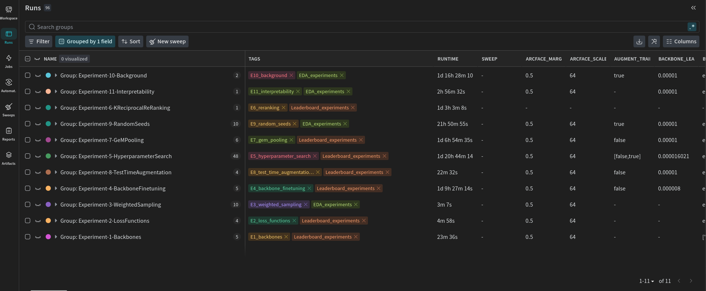

# Jaguar Re-Identification 🐆

This is the final project of the Seminar  "Applied Hands-On Computer Vision" at HPI. It evolves around a Kaggle competition about Jaguar Re-Identification ([Kaggle Link](https://www.kaggle.com/competitions/jaguar-re-id)).

All runs are logged to a public [W&B project](https://wandb.ai/juggling-jaguars/jaguar-reid-jugglingjaguars). You can group the runs by experiment or filter them using tags.

## Experiments

||Experiment|Type||||Credits|
|--|:--|:--|--|--|--|--:|
|01|Backbone Comparison|Leaderboard|[Documentation](LEADERBOARD_EXPERIMENTS.md#experiment-1---backbone-comparison)|[Notebook](notebooks/01_backbones.ipynb)|[W&B Run Group](https://wandb.ai/juggling-jaguars/jaguar-reid-jugglingjaguars/groups/Experiment-1-Backbones)|2|
|02|Loss Function Comparison|Leaderboard|[Documentation](LEADERBOARD_EXPERIMENTS.md#experiment-2---loss-function-comparison)|[Notebook](notebooks/02_loss_functions.ipynb)|[W&B Run Group](https://wandb.ai/juggling-jaguars/jaguar-reid-jugglingjaguars/groups/Experiment-2-LossFunctions)|2|
|03|Handling Data Imbalance with weighted Sampling|EDA|[Documentation](EDA_EXPERIMENTS.md#experiment-3---weighted-sampling)|[Notebook](notebooks/03_weighted_sampling.ipynb)|[W&B Run Group](https://wandb.ai/juggling-jaguars/jaguar-reid-jugglingjaguars/groups/Experiment-3-WeightedSampling)|1|
|04|Backbone Freezing vs Fine Tuning|Leaderboard|[Documentation](LEADERBOARD_EXPERIMENTS.md#experiment-4---backbone-fine-tuning)|[Notebook](notebooks/04_backbone_finetuning.ipynb)|[W&B Run Group](https://wandb.ai/juggling-jaguars/jaguar-reid-jugglingjaguars/groups/Experiment-4-BackboneFinetuning)|1|
|05|Hyperparameter Sweep|Leaderboard|[Documentation](LEADERBOARD_EXPERIMENTS.md#experiment-5---hyperparameter-search)|[Notebook](notebooks/05_hyperparamter_search.ipynb)|[W&B Run Group](https://wandb.ai/juggling-jaguars/jaguar-reid-jugglingjaguars/groups/Experiment-5-HyperparameterSearch)|1|
|06|K-Reciprocal Re-Ranking Parameter Sweep|Leaderboard|[Documentation](LEADERBOARD_EXPERIMENTS.md#experiment-6---k-reciprocal-re-ranking)|[Notebook](notebooks/06_k_reciprocal_re_ranking.ipynb)|[W&B Run Group](https://wandb.ai/juggling-jaguars/jaguar-reid-jugglingjaguars/groups/Experiment-6-KReciprocalReRanking)|1|
|07|GeM Pooling|Leaderboard|[Documentation](LEADERBOARD_EXPERIMENTS.md#experiment-7---gem-pooling)|[Notebook](notebooks/07_gem_pooling.ipynb)|[W&B Run Group](https://wandb.ai/juggling-jaguars/jaguar-reid-jugglingjaguars/groups/Experiment-7-GeMPooling)|1|
|08|Test-Time Agumentation|Leaderboard|[Documentation](LEADERBOARD_EXPERIMENTS.md#experiment-8---test-time-augmentation)|[Notebook](notebooks/08_test_time_augmentation.ipynb)|[W&B Run Group](https://wandb.ai/juggling-jaguars/jaguar-reid-jugglingjaguars/groups/Experiment-8-TestTimeAugmentation)|1|
|09|Random Seed Comparison|EDA|[Documentation](EDA_EXPERIMENTS.md#experiment-9---random-seed-comparison)|[Notebook](notebooks/09_seed_comparison.ipynb)|[W&B Run Group](https://wandb.ai/juggling-jaguars/jaguar-reid-jugglingjaguars/groups/Experiment-9-RandomSeeds)|1|
|10|Data with Background vs. without Background|EDA|[Documentation](EDA_EXPERIMENTS.md#experiment-10---background-vs-no-background)|[Notebook](notebooks/10_background.ipynb)|[W&B Run Group](https://wandb.ai/juggling-jaguars/jaguar-reid-jugglingjaguars/groups/Experiment-10-Background/)|1|
|11|Interpretability Visualization with Integrated Gradients|EDA|[Documentation](EDA_EXPERIMENTS.md#experiment-11---interpretability-with-integrated-gradients)|[Notebook](notebooks/11_interpretability.ipynb)|[W&B Run Group](https://wandb.ai/juggling-jaguars/jaguar-reid-jugglingjaguars/groups/Experiment-11-Interpretability)|1|
|**Total**||||||**13**|

All experiments were run on the HPI SCI cluster using an NVIDIA A100 80GB GPU.